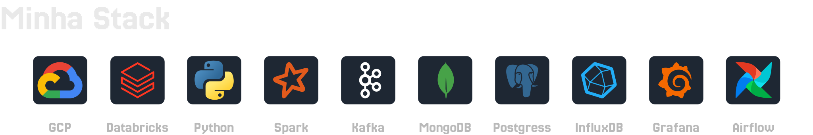

### Oi, visitante!
Quebrar a cabeça para construir farms no Minecraft pode parecer diferente de desenvolver uma arquitetura de dados, mas **ambas as áreas** compartilham desafios semelhantes: **entender as limitações, encontrar uma solução que utilize poucos recursos e que seja durável.**

> Esse paralelo vai além da minha paixão por jogos ou engenharia de dados, pois eu o utilizo para criar projetos que, de alguma forma, possam impactar as nossas vidas. **Por isso, convido você a conhecer os meus projetos.** 👋

 

  <picture>
    <source media="(prefers-color-scheme: dark)" srcset="./Stack-dark.svg">
    <source media="(prefers-color-scheme: light)" srcset="./Stack.svg">
    
  </picture>

## 🛠️ Projetos mais recentes
### [steam-feedbacks-classifier](https://github.com/lucasIsy/steam-feedbacks-classifier) | Batch
A arquitetura automatiza a extração de conteúdo útil dentre milhares de textos não estruturados(reviews ou feedbacks), permitindo encontrar rapidamente:
1. Problemas críticos ou recorrentes
2. Monitorar a efetividade das atualizações
3. Encontrar as áreas prioritárias no desenvolvimento do jogo ou serviço.
> Apresenta uma solução baseada em 3 pilares: **Filtragem(SQL + IA)**, **Fragmentação(IA)** e **Classificação(Embeddings, Herança por Proximidade Semântica, VectorDB)**
### [Gerenciador-de-bateria-inteligente](https://github.com/lucasIsy/Gerenciador-de-bateria-inteligente) | Streaming
Pipeline em streaming que gerencia o consumo de múltiplos IoT em baterias fotovoltaicas, permitindo que os dispositivos mais críticos possam operar durante a noite ou em situações de emergência. 
1. Economia gerada
2. Alertas de capacidade restante
3. Monitoramento em tempo real
4. Sistemas locais
